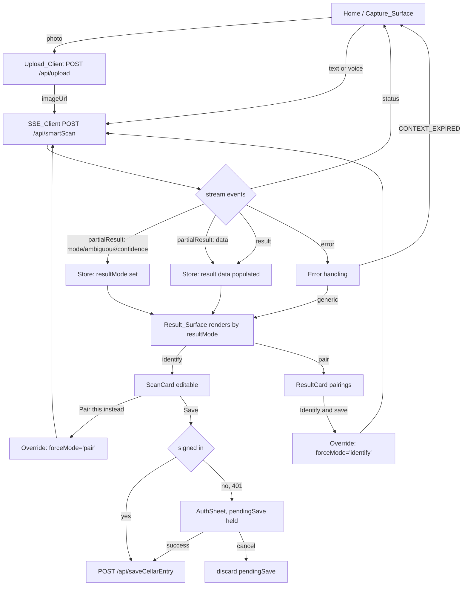

# Design Document

## Overview

Smart Scan Frontend rewires the SommSavvy web client to the unified `smartScan` backend. Today the client forces the user to pick a mode (`somm` vs `scan`) before capture, then calls one of two separate SSE endpoints (`pocketSomm` or `reverseScan`) through the MindStudio `@mindstudio-ai/interface` SDK. This design removes that choice: every capture posts to a single `/api/smartScan` endpoint, and the client renders the correct surface from routing metadata the stream emits early.

Three things change at once, and they are coupled:

1. **Transport migration.** The `createClient` RPC + platform upload from `@mindstudio-ai/interface` is replaced with a direct fetch-based SSE client and a multipart upload client that talk to the self-hosted Hono backend. This is the load-bearing migration seam.
2. **Routing consumption.** The client reads `{ mode, ambiguous, confidence }` from the stream and picks the surface, instead of deciding up front.
3. **Editable identity + overrides.** The identification card becomes editable before save, and both surfaces gain a one-tap override that re-calls `smartScan` with `forceMode`, reusing captured context.

The existing anonymous save-and-resume pattern (`pendingSave` + `AuthSheet`) is preserved and adapted to the new flow.

## Architecture

### Current state

- `web/src/api.ts` builds a typed RPC client via `createClient<{...}>()` from `@mindstudio-ai/interface`. Streaming is handled by the SDK's `onStreamData` mechanism; image upload by `platform.uploadFile`.
- `web/src/store.ts` (Zustand) holds `mode: 'somm' | 'scan'`, separate `pocketSommResult` and `scanResult` slots, `capturedImageUrl`, and `pendingSave`.
- `Home.tsx` reads `mode`, calls the matching endpoint, and writes the matching result slot.
- `Result.tsx` reads whichever result slot is populated and renders `ResultCard` (pairings) or `ScanCard` (identification).
- `ModeToggle.tsx` flips `mode`.

### Target state



### Migration seam: the SSE and upload clients

`@mindstudio-ai/interface` is a MindStudio platform artifact. It is replaced with two small stack-neutral modules:

- `web/src/lib/sse.ts` — `streamMethod(path, body, handlers)`: fetch POST that reads the response body as a stream, splits on `\n\n`, parses each `data:` line as JSON, and dispatches to typed handlers.
- `web/src/lib/upload.ts` — `uploadImage(file)`: multipart POST to `/api/upload`, returns `{ url }`.
- `web/src/api.ts` — thin typed wrappers for the plain JSON RPC methods (`saveCellarEntry`, `listCellar`, `getEntry`, etc.) using `fetch` + JSON, plus `smartScan` built on `streamMethod`.

All requests attach `Authorization: Bearer <jwt>` when a token is present. A `401` before the stream opens is surfaced as a `sign_in_required` signal.

## Components and Interfaces

### SSE_Client (`web/src/lib/sse.ts`)

```ts
export interface SmartScanRequest {
  imageUrl?: string;
  text?: string;
  depth?: Depth;
  forceMode?: 'identify' | 'pair';
}

export interface RoutingMeta {
  mode: 'identify' | 'pair';
  ambiguous: boolean;
  confidence: 'high' | 'medium' | 'low';
}

export type SmartScanData = ScanResult | PocketSommOutput;

export interface StreamHandlers {
  onStatus?: (text: string) => void;
  onRouting?: (meta: RoutingMeta) => void;
  onPartial?: (data: Partial<SmartScanData>) => void;
  onResult?: (result: { mode: 'identify' | 'pair'; ambiguous: boolean;
                         confidence: RoutingMeta['confidence']; data: SmartScanData }) => void;
  onError?: (err: { message: string; code?: string }) => void;
}

// Rejects with { code: 'sign_in_required' } if the server returns 401 before streaming.
export function streamSmartScan(
  body: SmartScanRequest,
  handlers: StreamHandlers,
  signal?: AbortSignal,
): Promise<void>;
```

Parsing rules:
- Read `response.body` via a reader + `TextDecoder`. Buffer text, split on blank lines, strip the leading `data:`.
- Classify each JSON event: an object with a top-level `status` string is a status event; `partialResult` containing `mode` is a routing event; `partialResult` without `mode` is a data event; `result` is final; `error` is failure.
- On non-2xx before the first read: if `401`, reject with `{ code: 'sign_in_required' }`; otherwise reject with a friendly generic message.

### Upload_Client (`web/src/lib/upload.ts`)

```ts
export async function uploadImage(file: Blob): Promise<string>; // returns url
```

Multipart `FormData` POST to `/api/upload` with the bearer token. Throws a friendly error on failure so `Home` can retain the preview and offer retry.

### Store changes (`web/src/store.ts`)

Remove input mode; track result routing and session context.

Removed:
- `mode: Mode`, `setMode`
- `pocketSommResult` / `scanResult` split (replaced by a single result slot)

Added:
```ts
type ResultMode = 'identify' | 'pair';

interface ScanSession {
  imageUrl?: string;      // uploaded image URL for the current scan
  text?: string;          // typed/transcribed text for the current scan
}

// New store slice
resultMode: ResultMode | null;
ambiguous: boolean;
confidence: 'high' | 'medium' | 'low' | null;
result: SmartScanData | null;   // ScanResult when identify, PocketSommOutput when pair
session: ScanSession | null;    // Session_Context for overrides + pending save
setRouting: (meta: RoutingMeta) => void;
setResult: (data: SmartScanData) => void;
setSession: (s: ScanSession | null) => void;
clearScan: () => void;          // clears result, routing, session
```

`clearScan` runs when the user navigates back to `Home`, satisfying the "clear previous result and session context" rule. `pendingSave` stays but its payload is built from the (possibly edited) card at save time.

Note: `Mode` type and `ModeToggle` component are deleted. `capturedImageUrl` folds into `session.imageUrl`.

### Capture_Surface (`Home.tsx`)

- `ModeToggle` removed from the layout.
- Photo path: `uploadImage(blob)` -> store `session.imageUrl` -> `streamSmartScan({ imageUrl, depth })`.
- Text path: `streamSmartScan({ text, depth })` with `session.text` set.
- Voice path: transcribe (existing `transcribeVoice`) to text first, then same as text path.
- Status events drive the existing scanning overlay copy.
- On the first routing event, navigate to `/result` (the surface can render skeleton-to-full as partial/final arrive). Alternatively render results inline; navigation preserves the existing route structure.
- Upload failure: show an inline error, keep the captured preview, offer retry. No smartScan call is made.

### Result_Surface (`Result.tsx`)

- Reads `resultMode`, `ambiguous`, `confidence`, `result` from the store.
- `resultMode === 'identify'` -> `ScanCard` (editable). `resultMode === 'pair'` -> `ResultCard` (pairings).
- Renders exactly one override action per surface:
  - identify: "Pair this instead" -> `runOverride('pair')`
  - pair: "Identify and save" -> `runOverride('identify')`
- When `ambiguous` is true, render the override with increased prominence (elevated button style rather than a quiet text link).
- `runOverride(target)`:
  1. If `session` has neither `imageUrl` nor `text`, navigate to `Home` with a "capture again" notice; do not call the backend.
  2. Otherwise call `streamSmartScan({ ...session, forceMode: target })`, replacing the surface with the new result on completion.
  3. If the stream errors with `code === 'CONTEXT_EXPIRED'`, navigate to `Home` with a "capture again" notice.
  4. If the override yields nothing usable, retain the current result and session.

### ScanCard editable identity (`ScanCard.tsx`)

The current `ScanCard` is read-only. It gains an edit affordance for the five `Identity_Fields`.

- `name`, `producer`, `region`: text inputs, max 200 chars.
- `vintage`: numeric input, valid range 1900..(currentYear + 1), empty allowed (null).
- `kind`: segmented control over `wine | beer | spirits`.
- Local editable state initialized from `result`; edits never mutate the store result until save.
- Low confidence (`confidence === 'low'`): existing uncertainty block stays, visually distinct; the save action is "unsettled" (secondary styling, requires an explicit confirm tap or at least one field edit) until the user confirms or edits.
- Client-side validation mirrors the server: empty name, out-of-range vintage, or invalid kind blocks save, shows a field-level error, and retains all edits.
- No numeric rating field is present (already true; preserved).
- On save, the payload is built from the edited local state, not the original model values.

### Save + anonymous resume

- Save builds `{ kind, name, producer, region, vintage, abv, photoUrl, source: 'scan', ... }` from edited fields and calls `saveCellarEntry`.
- Signed-in: one call, one entry.
- Anonymous: `saveCellarEntry` returns `401 sign_in_required`. The client stores the built payload as `pendingSave`, keeps the card visible, and opens `AuthSheet`. On auth success it replays `pendingSave` exactly once. On cancel it clears `pendingSave` without calling save.

## Data Models

No new persistent models on the client. Types in `web/src/types.ts` change:

- Remove `export type Mode = 'somm' | 'scan';`.
- Add `export type ResultMode = 'identify' | 'pair';`.
- Add `RoutingMeta` and `SmartScanResult` types mirroring the backend contract.
- `saveCellarEntry` input already carries the identity fields; add `tasted?`/`owned?` only if the server wrapper expects them (server sets scan defaults regardless).

Session context (`ScanSession`) is memory-only; it is never persisted to localStorage (the persisted slice stays `depth`, `theme`, `hasSeenWelcome`).

## Correctness Properties

1. **Round-trip parse.** For any well-formed final `result` event, parsing the stream and writing to the store yields a `result` object deep-equal to the event's `data`.
2. **Deterministic surface.** For a given `resultMode` in the store, `Result` always renders the corresponding surface (identify -> ScanCard, pair -> ResultCard) and exactly one override action.
3. **Edited values persist.** For any valid edit to an identity field, the payload sent to `saveCellarEntry` contains the edited value, not the original model value.
4. **Validation gate.** For any input with empty name, out-of-range vintage, or invalid kind, the client blocks the save call (no network request) and retains edits.
5. **Single save.** A pending save replayed after successful auth issues exactly one `saveCellarEntry` call; a canceled auth issues zero.
6. **Override reuse.** An override call sends the current `session` context and never triggers a new capture; when `session` is empty the client routes to Home without a backend call.
7. **Context expiry recovery.** A `CONTEXT_EXPIRED` error always returns the user to Home with a capture-again notice and never leaves a broken surface.
8. **No input mode.** The store never holds a user-chosen input mode; `resultMode` is only ever set from a routing event.

## Error Handling

| Condition | Client behavior |
|---|---|
| Upload fails | Inline error on Home, preview retained, retry offered, no scan call |
| `401` before stream | Treat as `sign_in_required`; open AuthSheet (save flow) |
| Stream `error` generic | Show friendly message on the surface, keep Home reachable, no stack traces |
| Stream `error` `CONTEXT_EXPIRED` | Navigate to Home with "capture again" notice |
| Override with empty session | Navigate to Home with "capture again" notice, no backend call |
| Validation failure on save | Field-level error, block save, retain edits |

All user-facing copy follows the brand voice rules: no exclamation points, no emoji, no em dashes.

## Testing Strategy

- **SSE parser unit tests:** status/routing/partial/final/error classification; chunked and split-across-boundary `data:` lines; 401-before-stream rejection.
- **Store tests:** `setRouting` sets `resultMode`; `clearScan` wipes result/session/routing; `pendingSave` set/replay/clear.
- **ScanCard tests:** editable fields update local state only; validation blocks invalid save; edited values flow into the save payload; low-confidence save is unsettled until confirm/edit; no rating field rendered.
- **Result surface tests:** correct surface per `resultMode`; exactly one override action; prominent override when `ambiguous`.
- **Override flow tests:** reuse of session context with `forceMode`; empty-session and `CONTEXT_EXPIRED` both route to Home.
- **Anonymous resume tests:** 401 opens AuthSheet, success replays once, cancel discards.
- **Upload client tests:** multipart shape, bearer header, failure surfaces a friendly error.

Property-based tests cover properties 1, 3, 4, and 5 with generated field edits and stream payloads.

## Migration Seams (platform capabilities to replace)

- **RPC transport:** `@mindstudio-ai/interface` `createClient` -> fetch JSON wrappers in `api.ts`. The new build owns error mapping and auth headers.
- **Streaming:** SDK `onStreamData` -> `web/src/lib/sse.ts` fetch reader. The new build owns event framing and parsing.
- **Image upload:** `platform.uploadFile` -> `web/src/lib/upload.ts` multipart POST to `/api/upload`. The new build owns the upload endpoint and storage decision.
- **Auth token storage/attachment:** the new build owns where the JWT lives (memory + storage) and attaches it to every request.
