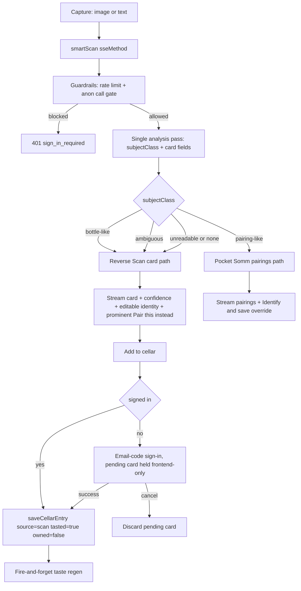

# Design Document

## Overview

Smart Scan removes the mode-choice the scan surface forces on the user today. Currently the frontend decides whether a capture goes to `reverseScan` (identification) or `pocketSomm` (pairings) before the camera has seen anything, and both are separate SSE endpoints. This design introduces a single entry method, `smartScan`, that classifies the captured subject inside the existing vision/analysis pass and routes to identification-and-capture or pairings with no extra user step and no extra AI round-trip.

The design reuses the existing identification card, save path, taste-summary regeneration, and image guardrails. The new pieces are the classifier folded into the analysis step, the unified routing entry point, the capture-first save with editable identity, and one-tap overrides that reuse already-captured context.

This is a migration off a MindStudio platform. Provider capabilities are described plainly. The legacy `mindstudio` object in `server/src/ai/index.ts` is a compatibility shim and is flagged as a migration seam.

## Architecture

### Current state

- `reverseScan` and `pocketSomm` are both `sseMethod` endpoints in `server/src/methods/routes.ts`.
- The frontend picks which to call based on a user-selected mode.
- Both run through the AI shim `server/src/ai/index.ts`: `analyzeImage` (Gemini Flash vision), `generateText` (Claude Haiku, JSON-coerced), `generateImage` (Gemini image), `executeStepBatch` (parallel images).
- Guardrails (`server/src/usage/guardrails.ts`) and the `sseMethod` wrapper enforce per-IP rate limiting and an anonymous call gate returning `401 sign_in_required` before the stream opens.
- `saveCellarEntry` requires `auth.userId`, validates name and kind, persists via `CellarEntries.push`, then fires `runTasteSummaryRegen` fire-and-forget.

### Target state

A new `smartScan` `sseMethod` becomes the single scan entry point. It performs one analysis pass that returns a subject classification plus, on the bottle path, the identification card, then routes:

- bottle-like, ambiguous, or unreadable subject to the Reverse Scan card
- pairing-like subject to Pocket Somm pairings

`reverseScan` and `pocketSomm` remain as internal functions that `smartScan` delegates to, preserving their streaming, portrait gating, and guardrail logic.

### Classification strategy: single pass

The requirement is classification within the existing analysis step with no extra round-trip where avoidable. Two options were considered:

1. Classify-then-delegate: a cheap first call returns only the subject class, then a second call produces the card or pairings. Rejected because it adds latency to the common bottle path.
2. Single-pass classify-and-produce (chosen): the analysis prompt is extended to return a `subjectClass` field alongside the card fields. For a bottle-like subject the card returns in the same response. For a pairing-like subject, the analysis output feeds the existing pocketSomm generation. The text-only path classifies in the same `generateText` pass.

The chosen approach costs one extra field in an existing prompt, not an extra call.

### Flow diagram

## Components and Interfaces

### smartScan (new entry method)

`sseMethod('/smartScan', smartScan)` in `routes.ts`.

Input: `{ imageUrl?, text?, depth?, forceMode?: 'identify' | 'pair' }`. `forceMode` supports overrides.

Behavior:
- Validates at least one of `imageUrl` / `text`; otherwise streams a recoverable error.
- Runs one analysis pass producing `{ subjectClass, ...cardOrContext }`, where `subjectClass` is `bottle-like | pairing-like | ambiguous | none`.
- Routes per the diagram. `ambiguous` and `none` default to the identification path.
- Emits SSE `{ partialResult }` with a `mode` discriminator (`identify` | `pair`), `confidence`, and an ambiguous flag so the frontend renders the correct surface and a prominent override.

### Scan_Router (classification)

Not a separate service; it is the classification logic inside the analysis pass. The vision prompt decides `subjectClass` first, then fills card fields only for bottle-like/ambiguous. The text path classifies in the one `generateText` pass. Given a fixed analysis response, routing is a pure function of `subjectClass`.

### Reverse_Scan card and editable identity

Reuses the existing `ScanResult`: `{ name, kind: 'wine'|'beer'|'spirits', producer, region, vintage, abv, expect, monocleAside, pairings[], valueNote, occasion, confidence: 'high'|'medium'|'low', photoUrl?, notice? }`.

- Frontend presents `name`, `producer`, `region`, `vintage`, `kind` as editable before save.
- Low confidence renders a visually distinct uncertainty indicator and defers treating save as settled until the user confirms or edits at least one field.
- No numeric rating field anywhere in the card.

### Save path

- Signed-in: frontend calls `saveCellarEntry` with edited identity fields plus `source: 'scan'`; entry created with `tasted = true`, `owned = false`; existing fire-and-forget regen runs, deriving from tasted entries only.
- Anonymous: `saveCellarEntry` requires `auth.userId`; the existing `401 sign_in_required` is the sign-in trigger. The card (with edits) is held in frontend session state only. After email-code auth succeeds, the frontend replays the save, producing exactly one entry. Cancel discards the pending card.

### Override

- Card view shows one "Pair this instead" action; pairings view shows one "Identify and save" action.
- Invoking an override re-calls `smartScan` with the same captured `imageUrl` / `text` from session state and `forceMode` set to the other branch. No new capture.
- If session context is gone, the override returns the user to the multimodal entry surface. If the redirected flow returns nothing, the original result and context are retained.

## Data Models

No new tables. The data model stays `users` + `cellar_entries`.

`cellar_entries` must carry:
- `source`: existing enum `'somm' | 'scan' | 'manual'`; scan saves use `'scan'`.
- `tasted`: boolean; scan saves set `true`. Regen treats `tasted !== false` as tasted (legacy null counts as tasted).
- `owned`: boolean; scan saves set `false`. Toggling `owned` never triggers regen.

Implementation action item: confirm `tasted` and `owned` columns exist on the `cellar_entries` table and that `SaveInput` in `saveCellarEntry` accepts them. The current `SaveInput` does not explicitly list them; if absent, add two booleans to the existing table and input (fields on the existing table, not a new table).

Enum reconciliation: requirements say `wine/beer/spirit`; the codebase uses `wine | beer | spirits` (plural). This design uses `spirits`. Recommendation: align the requirements to `spirits` when generating tasks to avoid a data migration.

## Correctness Properties

1. Signed-in save produces exactly one `cellar_entries` row with `source='scan'`, `tasted=true`, `owned=false`.
2. For any sequence of `owned` toggles, `runTasteSummaryRegen` is never invoked as a result.
3. For any provider error, timeout, or unrecognized subject, the cellar row count is unchanged.
4. For any valid edit to an identity field, the persisted entry contains the edited value and it survives re-fetch without reverting to the model guess.
5. For a fixed analysis response with a given `subjectClass`, routing is always the same branch: `bottle-like | ambiguous | none -> identify`; `pairing-like -> pair`.
6. For any scan that returns no card or fails, the image counter is unchanged.
7. For any card where portrait generation is skipped or fails, the card is returned and a subsequent save succeeds.
8. For any input with empty name, out-of-range vintage, or invalid kind, save is rejected and no row is created.
9. A pending card saved after successful sign-in yields exactly one entry; a canceled sign-in yields zero.

## Error Handling

Maps to the recovery requirements, reusing existing behavior:

- No recognizable subject: stream a recoverable message offering retake-photo and typed-name; no card returned. Image counters unchanged since no portrait is attempted.
- Provider error or no response within 30 seconds (Provider_Timeout): the `sseMethod` wrapper emits a single `{ error: { message } }` with a friendly message and no stack trace. No entry is created because save is a separate user action.
- Portrait unavailable (guardrail limit or provider failure): existing reverseScan behavior streams the text card before portrait generation and treats portrait failure as non-fatal without incrementing counters. The card is returned and remains saveable.
- After any failure, the scan and typed-name entry actions remain available.

## Testing Strategy

- Property-based tests for the nine Correctness Properties, achieving determinism by stubbing the analysis/model response.
- Unit tests for classification-to-route mapping across `bottle-like | pairing-like | ambiguous | none`.
- Unit tests for save flag-setting (`source=scan`, `tasted=true`, `owned=false`) and validation rejection (empty name, out-of-range vintage, invalid kind).
- Integration tests for the anonymous save resume (401 trigger, replay after auth, cancel discards) and for override context reuse without re-capture, including stale-context recovery.
- Integration tests for error paths: unrecognized subject, provider error and 30s timeout, portrait-absent degradation still saveable, and no image quota charged on failed identification.

## Migration Seams (platform capabilities to replace)

- Email-code delivery and auth: the Kiro build owns code generation, delivery, and verification. Email-code only; no passwords, SMS, social, or roles.
- Managed database: the Kiro build owns the DB and the `source/tasted/owned` columns.
- Fire-and-forget background job runner: `runTasteSummaryRegen` is a fire-and-forget promise today; production should use an explicit background mechanism so a crash mid-regen is not silently lost.
- Image generation: portrait generation gated by Image_Guardrails, owned by the `cost-gaurdrails` spec. Consume that gating.
- The `mindstudio` shim in `server/src/ai/index.ts`: a legacy name wrapping direct provider SDKs; rename to a neutral provider interface over time.
